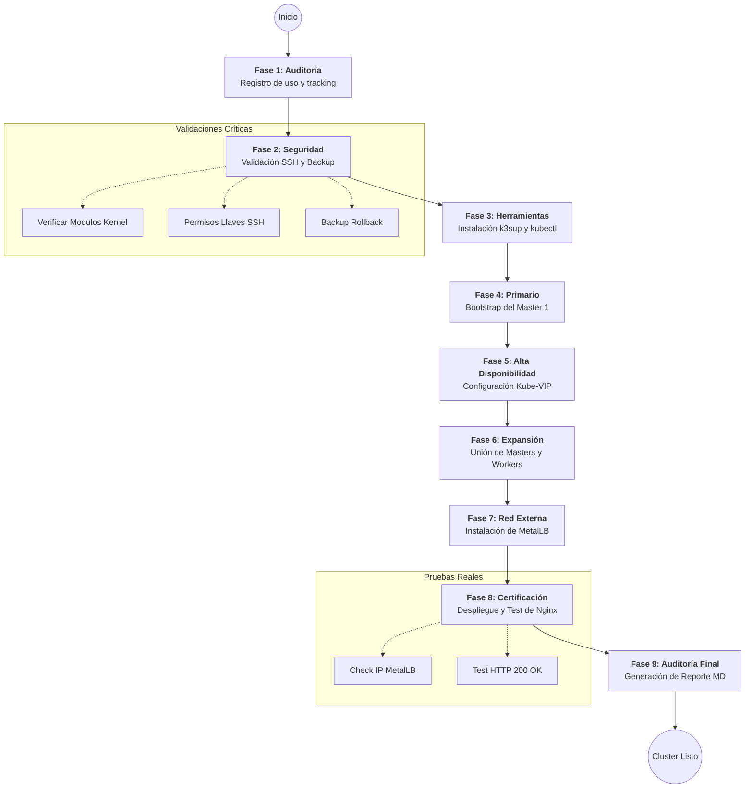

# K3s High Availability Cluster Setup
Este repositorio contiene los scripts necesarios para desplegar un cluster de **K3s en Alta Disponibilidad (HA)** utilizando `k3sup`, `kube-vip` y `MetalLB`.

## 🚀 Instalación Rápida
Puedes descargar y ejecutar el instalador completo con un solo comando:

```bash
curl -fsSL https://raw.githubusercontent.com/Ricardowec51/k3s-ha-cluster/main/k3s_installer_complete.sh -o k3s_installer_complete.sh && chmod +x k3s_installer_complete.sh && ./k3s_installer_complete.sh
```

## 📊 Flujo de Ejecución del Instalador



---

### 📑 Explicación Exhaustiva de la Ejecución

El script `k3s_installer_complete.sh` no es solo un comando de instalación, es un flujo de ingeniería dividido en etapas para garantizar la estabilidad:

#### **Fase 1: Registro y Auditoría**
El script genera una huella digital de cada ejecución en `~/.k3s_usage_tracking.log`. Esto permite saber exactamente cuántas veces se ha desplegado el cluster, detectando si es una instalación nueva o una actualización.

#### **Fase 2: Fortificación y Respaldo**
Antes de modificar el sistema:
*   **Backup**: Realiza copias de seguridad de tu actual `.kube/config` y archivos SSH.
*   **Rollback**: Genera de forma dinámica un script de "marcha atrás" en la carpeta de backup por si algo falla.
*   **Kernel Check**: Verifica que los módulos `overlay` y `br_netfilter` estén activos (necesarios para el tráfico de contenedores).

#### **Fase 3: Base Tecnológica**
Instala binarios específicos y validados:
*   **k3sup v0.13.11**: Para despliegue remoto sin agentes.
*   **kubectl**: Configurado para el nuevo contexto `k3s-ha-dev`.

#### **Fase 4: Inicialización del Master Primario**
Se lanza el comando `k3sup install` en el **Master 1**. En este punto se configura el DB del cluster y se tienta al nodo para que no acepte cargas de trabajo (workers) todavía, protegiendo el plano de control.

#### **Fase 5: Alta Disponibilidad (Kube-VIP)**
Es el componente más importante para la HA. Crea una **IP Virtual (VIP)**. Si el Master 1 se apaga, la IP "vuela" al Master 2 o 3 en milisegundos, haciendo que el cluster nunca deje de responder.

#### **Fase 6: Expansión del Plano de Control y Datos**
Se unen de forma secuencial el resto de los Masters y Workers. En modo desarrollo, el script espera 20 segundos entre cada nodo para asegurar que la base de datos distribuida (etcd) se sincronice correctamente.

#### **Fase 7: Networking y Balanceo (MetalLB)**
Instala MetalLB en modo L2. Esto dota al cluster de la capacidad de asignar IPs de tu red local a servicios de Kubernetes. Sin esto, tus aplicaciones solo serían accesibles internamente.

#### **Fase 8: Certificación de Funcionamiento (Prueba Real)**
Para asegurar que todo el trabajo anterior es válido:
1.  Despliega un **Deployment de Nginx**.
2.  Crea un **Service tipo LoadBalancer**.
3.  Espera a que MetalLB asigne una IP.
4.  Lanza una petición HTTP real. Si el servidor responde "Welcome to nginx", la prueba es exitosa.

#### **Fase 9: Reporte de Ingeniería**
Finalmente, el script compila toda la información (nodos, IPs, pods, logs de errores) y crea un reporte en formato Markdown (`.md`). Es tu bitácora de instalación profesional.

---

## 🛠️ Configuración
Antes de ejecutar, asegúrate de editar las variables al inicio del script `k3s_installer_complete.sh`:
- **USER**: Tu usuario con acceso SSH.
- **INTERFACE**: Interfaz de red de los nodos (ej: `ens18`).
- **MASTER1, 2, 3**: IPs de tus nodos maestros.
- **WORKER1, 2, 3**: IPs de tus nodos trabajadores.
- **VIP**: IP flotante para el acceso al API Server (HA).
- **LB_RANGE**: Rango de IPs para servicios externos (MetalLB).

## 📦 Contenido
- `k3s_installer_complete.sh`: Script principal de automatización.
- `scripts/utils/health-check.sh`: Verifica la salud del cluster.
- `scripts/utils/backup-cluster.sh`: Realiza un respaldo rápido de la configuración.

## 📋 Requisitos
- 3 VMs con Ubuntu 22.04/24.04 para Masters.
- Al menos 1 VM para Worker.
- Acceso SSH mediante llaves (sin contraseña) configurado entre el equipo que ejecuta el script y los nodos.
- `sudo` configurado sin contraseña en los nodos.
