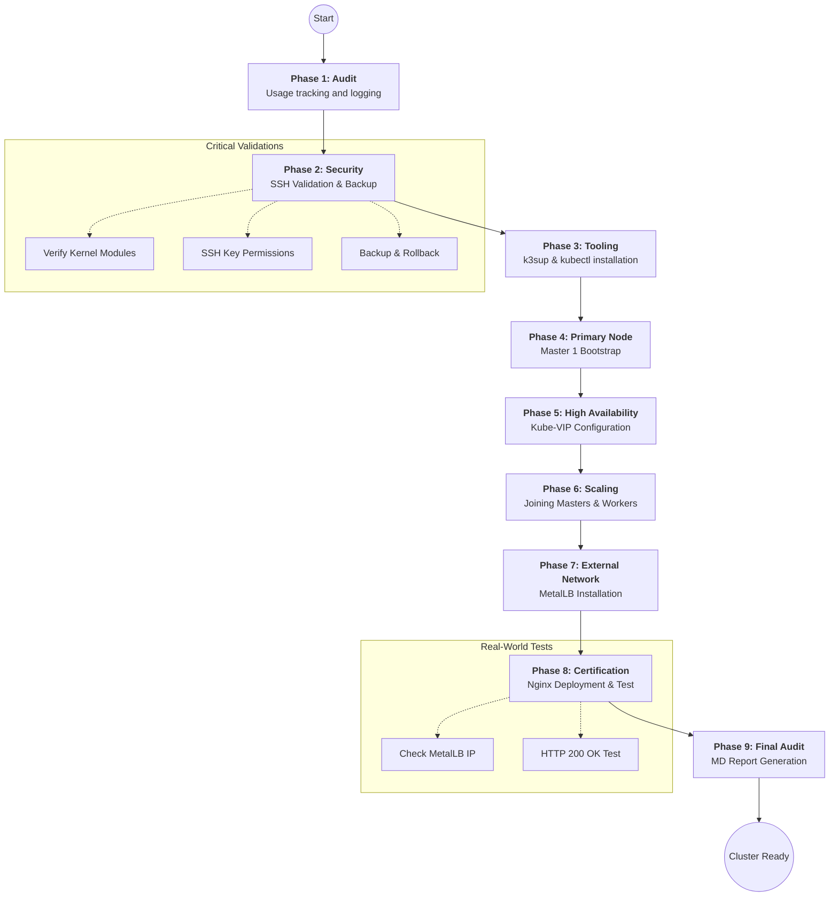

# K3s High Availability Cluster Setup
This repository contains the necessary scripts to deploy a **K3s High Availability (HA)** cluster using `k3sup`, `kube-vip`, and `MetalLB`.

## 🚀 Quick Start
You can download and execute the complete installer with a single command:

```bash
curl -fsSL https://raw.githubusercontent.com/Ricardowec51/k3s-ha-cluster/main/k3s_installer_complete.sh -o k3s_installer_complete.sh && chmod +x k3s_installer_complete.sh && ./k3s_installer_complete.sh
```

## 📊 Deployment Workflow



---

### 📑 Exhaustive Execution Breakdown

The `k3s_installer_complete.sh` script is an engineering workflow divided into stages to guarantee stability:

#### **Phase 1: Registry and Audit**
The script generates a digital footprint for every execution in `~/.k3s_usage_tracking.log`. This allows tracking of how many times the cluster has been deployed, identifying if it's a new installation or an update.

#### **Phase 2: Fortification and Backup**
Before any system modification:
*   **Backup**: Creates security copies of your current `.kube/config` and SSH files.
*   **Rollback**: Dynamically generates a "rollback" script in the backup folder in case of failure.
*   **Kernel Check**: Verifies that `overlay` and `br_netfilter` modules are active (required for container traffic).

#### **Phase 3: Technology Foundation**
Installs specific, validated binaries:
*   **k3sup v0.13.11**: For agentless remote deployment.
*   **kubectl**: Configured for the new `k3s-ha-dev` context.

#### **Phase 4: Primary Master Initialization**
Launches the `k3sup install` command on **Master 1**. At this point, the cluster database is configured, and the node is tainted to prevent accepting worker workloads yet, protecting the control plane.

#### **Phase 5: High Availability (Kube-VIP)**
The most critical component for HA. It creates a **Virtual IP (VIP)**. If Master 1 goes down, the IP "floats" to Master 2 or 3 in milliseconds, ensuring the cluster never stops responding.

#### **Phase 6: Scaling Control Plane and Workers**
Remaining Masters and Workers join sequentially. In development mode, the script waits between nodes to ensure the distributed database (etcd) synchronizes correctly.

#### **Phase 7: Networking and Load Balancing (MetalLB)**
Installs MetalLB in L2 mode. This enables the cluster to assign real IPs from your local network to Kubernetes services. Without this, your applications would only be accessible internally.

#### **Phase 8: Functional Certification (Real-World Test)**
To ensure all previous work is valid:
1.  Deploys an **Nginx Deployment**.
2.  Creates a **LoadBalancer Service**.
3.  Waits for MetalLB to assign an IP.
4.  Launches a real HTTP request. If the server responds "Welcome to nginx", the test is successful.

#### **Phase 9: Engineering Report**
Finally, the script compiles all information (nodes, IPs, pods, error logs) and creates a Markdown (`.md`) report. This is your professional installation log.

---

## 🛠️ Configuration
Before executing, make sure to edit the variables at the beginning of the `k3s_installer_complete.sh` script:
- **USER**: Your Linux user with SSH access.
- **INTERFACE**: Network interface of the nodes (e.g., `ens18`).
- **MASTER1, 2, 3**: IPs for your Master nodes.
- **WORKER1, 2, 3**: IPs for your Worker nodes.
- **VIP**: Floating IP for API Server access (HA).
- **LB_RANGE**: IP range for external services (MetalLB).

## 📦 Contents
- `k3s_installer_complete.sh`: Main automation script.
- `scripts/utils/health-check.sh`: Verifies cluster health.
- `scripts/utils/backup-cluster.sh`: Performs a quick configuration backup.

## 📋 Prerequisites
- 3 VMs with Ubuntu 22.04/24.04 for Masters.
- At least 1 VM for Workers.
- SSH access via keys (passwordless) configured between the local machine and the nodes.
- `sudo` configured without a password on the nodes.
