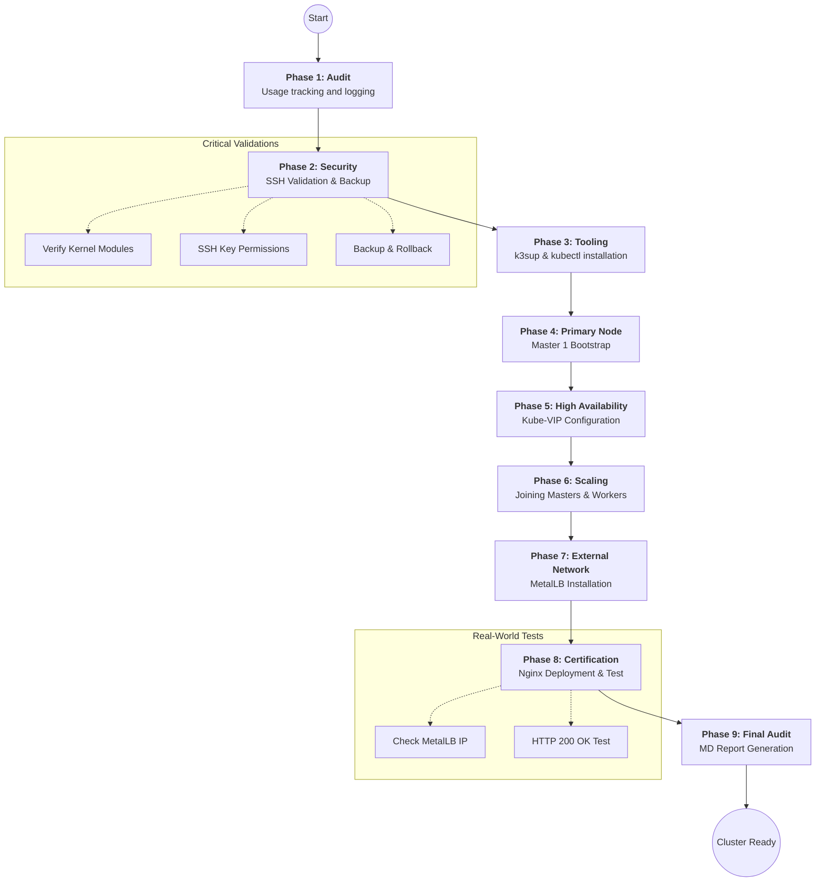

# K3s High Availability Cluster - Professional Automated Deployment

This repository provides a production-grade orchestration toolset to deploy and manage a **K3s High Availability (HA)** cluster. It uses `k3sup` for agentless installation, `kube-vip` for control-plane redundancy, and `MetalLB` for bare-metal load balancing.

---

## 🏗️ General Architecture



---

## 🛠️ Detailed Script Documentation

### 1. `k3s_installer_complete.sh` (Main Orchestrator)
This is the core of the repository. It automates the entire lifecycle of the cluster setup.

*   **What it does:**
    *   Validates local and remote environment prerequisites.
    *   Balances the control plane across 3 Master nodes using `etcd`.
    *   Implements **Kube-VIP** for a floating Virtual IP (Zero-Downtime API).
    *   Joins Worker nodes with specific labels (`longhorn=true`, `worker=true`).
    *   Configures **MetalLB** for automatic External IP assignment.
    *   Performs an end-to-end test by deploying an Nginx server and verifying HTTP connectivity.
    *   Generates a comprehensive Markdown report of the installation.

*   **Pre-configuration Requirements:**
    *   **SSH Keys**: You must have an SSH key (default `id_rsa`) in `~/.ssh/`.
    *   **User Variables**: Edit the top of the script to set:
        *   `USER`: The remote username (must have passwordless sudo).
        *   `INTERFACE`: The network interface (e.g., `eth0`, `ens18`).
        *   `MASTER_IPs` & `WORKER_IPs`: Static IPs for your VMs.
        *   `VIP`: A free IP in your subnet for the Cluster API.
        *   `LB_RANGE`: A reserved range for your exposed services.

---

### 2. `scripts/utils/health-check.sh`
A diagnostic utility to ensure the cluster is operating within normal parameters.

*   **What it does:**
    *   Verifies node status (Ready/NotReady).
    *   Checks the health of critical system pods in `kube-system` and `metallb-system`.
    *   Lists active StorageClasses and PVCs.
    *   Identifies LoadBalancer services and their assigned IPs.

*   **Pre-configuration Requirements:**
    *   Requires `kubectl` installed and a valid `~/.kube/config`.
    *   Should be run after the cluster installation is complete.

---

### 3. `scripts/utils/backup-cluster.sh`
A lightweight backup tool for disaster recovery and state auditing.

*   **What it does:**
    *   Creates a timestamped snapshot folder in `./backups/`.
    *   Backs up the local `kubeconfig` file.
    *   Exports the current state of all Nodes and Services to text files.

*   **Pre-configuration Requirements:**
    *   Requires `kubectl` access.
    *   Ensure the script has write permissions in the directory where it's executed.

---

### 4. `scripts/utils/monthly-maintenance.sh`
Guides the monthly Proxmox host update/reboot cycle so that etcd never loses quorum and services stay up. Hosts are handled **one at a time**.

*   **Subcommands:**
    *   `status` — VM→host layout, node readiness, etcd health, Proxmox quorum, unhealthy pods.
    *   `prepare <host> [--dry-run]` — pre-flight checks (all nodes Ready, etcd ok, no failing pods, Proxmox quorate, the *other* hosts up for at least `SOAK_MIN` minutes, host does not carry more than one master), CloudNativePG switchover if the primary lives on that host (its PDB would otherwise block the drain), then `cordon` + `drain` of the host's worker.
    *   `restore <host>` — waits for the host's VMs to be `Ready`, `uncordon`s the worker and verifies etcd and pods before the next host is touched.

*   **Workflow:** `prepare <host>` → update/reboot the host in Proxmox (manual) → `restore <host>` → wait `SOAK_MIN` minutes → next host.

*   **Notes:**
    *   `kubectl` falls back across the three masters, because the kubeconfig usually points at master-01, which goes down with its host.
    *   With an even number of Proxmox votes online below the expected count (e.g. a dead node), taking one host down drops Proxmox quorum for the duration: running VMs keep running but nothing can be started or migrated. That is why quorum is only required in `prepare`.
    *   Host list, master IPs and VMID→node mapping are variables at the top of the script.

---

## 📋 System Prerequisites (Preparation is Key)

To ensure a successful deployment, your environment **must** meet these conditions:

1.  **OS Support**: Ubuntu 22.04 LTS or 24.04 LTS on all nodes.
2.  **SSH Access**: 
    ```bash
    ssh-copy-id -i ~/.ssh/id_rsa.pub user@node-ip
    ```
3.  **Passwordless Sudo**: The user must be able to run `sudo` without being prompted for a password.
    *   *Fix*: `echo "user ALL=(ALL) NOPASSWD:ALL" | sudo tee /etc/sudoers.d/user`
4.  **Network**:
    *   Static IPs for all nodes.
    *   Internet access for nodes to download K3s binaries and Docker images.
5.  **Kernel Modules**: The script will attempt to load them, but ensure `overlay` and `br_netfilter` are not blacklisted.

---

## 🚀 Execution

```bash
# 1. Clone the repo
git clone https://github.com/Ricardowec51/k3s-ha-cluster.git

# 2. Configure variables
nano k3s_installer_complete.sh

# 3. Run the installer
chmod +x k3s_installer_complete.sh
./k3s_installer_complete.sh
```

---

## 📈 Tracking and Logs
*   **Usage Logs**: `~/.k3s_usage_tracking.log` (Internal use).
*   **Deployment Logs**: `k3s_dev_test_[timestamp].log`.
*   **Debug Logs**: `k3s_debug_[timestamp].log`.
*   **Installation Report**: `k3s_installation_report_[timestamp].md`.
